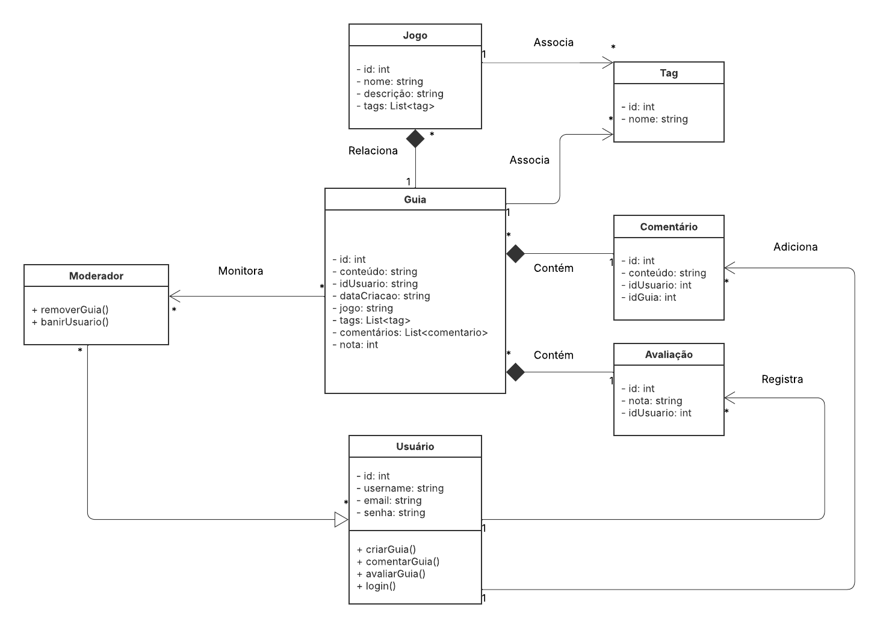

# Diagrama de Classes

## Introdução

Os diagramas de classes são elementos essenciais da UML (Unified Modeling Language) e fazem parte dos diagramas estruturais usados para representar a estrutura estática de um sistema. Eles são fundamentais na modelagem orientada a objetos, permitindo descrever as classes que compõem um sistema, seus atributos, operações, e os relacionamentos entre elas. Essa representação facilita a compreensão, especificação e documentação do sistema em diferentes fases do desenvolvimento, como análise, design e implementação.

## Metodologia

Para criar o diagrama de classes, analisamos o projeto para identificar as principais entidades, métodos e atributos. Essas definições podem ser vistas neste documento: [ACESSO](https://docs.google.com/document/d/1FAuYqqCOM6dSgEaRmESRIExmBsOCEnG8qxCVmocoBr8/). Em seguida, utilizamos o [Lucidchart](https://www.lucidchart.com/pages) para criar o diagrama em UML.

## Diagrama Visual

Este diagrama apresenta uma versão simplificada, mostrando as principais classes e métodos.

Figura 1 - Diagrama de Classes (Autores: Rodrigo Gontijo e Henrique Galdino)

## Bibliografia 

> IBM. Diagramas de classes. IBM Documentation, 2021. Disponível em: https://www.ibm.com/docs/pt-br/rsas/7.5.0?topic=structure-class-diagrams. Acesso em: 06 de maio de 2025.
> 
> SERRANO Milene. 05b - VideoAula - DSW-Modelagem - Diagrama de Classe. Disponível na plataforma Aprender3. Acesso em 05 de maio de 2025.

## Histórico de versão:

| Versão | Alteração                  | Responsável     | Revisor | Data       | Detalhes da Revisão |
| -      | -                          | -               | -       | -          | -                   |
| 1.0    | Elaboração do texto | [Rodrigo Gontijo](https://github.com/rodrigogontijoo) | | 06/05/2025 | |
| 1.1    | Elaboração do diagrama | [Henrique Galdino](https://github.com/hgaldino05) e [Rodrigo Gontijo](https://github.com/rodrigogontijoo) | [Rodrigo Orlandi](https://github.com/OrlandiRodrigo) | 06/05/2025 | Melhorar parte de Metodologia, adicionando hyperlink para docs com definições |
| 1.2    | Adição de hyperlink para docs | [Rodrigo Gontijo](https://github.com/rodrigogontijoo) | | 07/05/2025 | |
