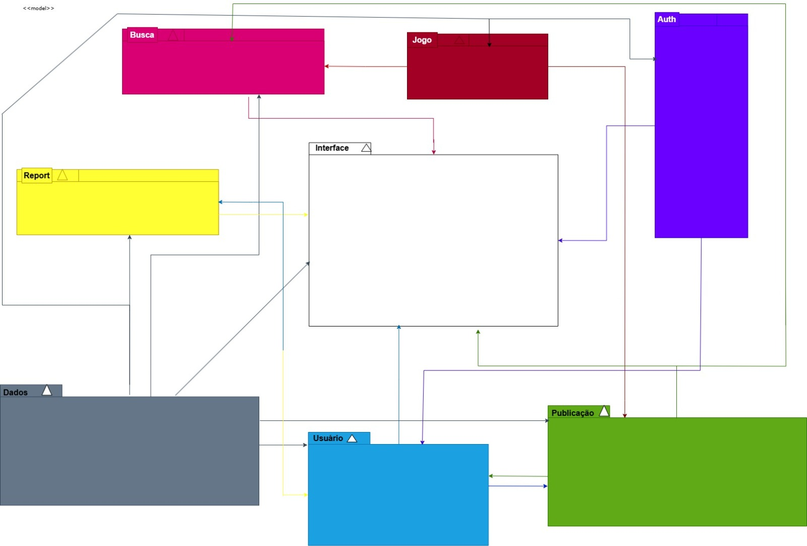

# Diagrama de Pacotes - Plataforma de Guias de Jogos

## Introdução

O **Diagrama de Pacotes** é uma representação visual usada para organizar e estruturar os componentes de um sistema. Ele mostra como diferentes módulos ou pacotes do sistema se relacionam entre si e como as dependências são organizadas. Esse tipo de diagrama é útil para entender a arquitetura do sistema e a distribuição das responsabilidades entre os diferentes pacotes.

Neste caso, apresentamos o diagrama de pacotes para a plataforma de guias de jogos, que abrange desde o sistema de autenticação e gestão de usuários até a moderação de conteúdo e a interface com o usuário.

---

## Pacotes Principais

### 1. `auth`
> Responsável pelo sistema de autenticação e sessão de usuários.
- LoginController
- RecuperarSenha
- SessaoUsuario

---

### 2. `usuario`
> Define perfis, permissões e atividades dos usuários.
- Usuario
- Perfil
- Moderador (herda de Usuario)
- Administrador (herda de Usuario)

---

### 3. `publicacao`
> Controla guias, rascunhos, avaliações e comentários.
- Post
- Rascunho
- Comentario
- Avaliacao
- Spoiler

---

### 4. `jogo`
> Armazena dados sobre os jogos referenciados nas publicações.
- Jogo
- Tag

---

### 5. `busca`
> Módulo responsável pelas funcionalidades de pesquisa.
- Buscador
- FiltroPorTag
- FiltroPorNome

---

### 6. `report`
> Gerencia denúncias, moderação e penalidades.
- ReportPost
- ReportComentario
- Penalidade

---

### 7. `interface`
> Telas e interações com o usuário final.
- TelaLogin
- TelaPrincipal
- TelaPost
- TelaPerfil
- TelaBusca
- TelaEscrita
- TelaModerador

---

### 8. `dados`
> Camada de persistência do sistema.
- RepositorioUsuarios
- RepositorioPosts
- RepositorioJogos
- RepositorioComentarios
- RepositorioReports

---

## Dependências entre Pacotes

As dependências entre os pacotes podem ser resumidas da seguinte forma:

```text
interface → usuario, auth, publicacao, busca, report
usuario → auth, publicacao, report
moderador → usuario, report
publicacao → jogo, usuario, dados
busca → dados, jogo, publicacao
report → usuario, dados
dados → (usado por todos os outros pacotes)
```

Cada pacote depende de outros pacotes para fornecer funcionalidades específicas, o que reflete a estrutura modular e flexível do sistema.

---

## Diagrama Visual

O diagrama de pacotes e as dependências entre eles estão ilustrados a seguir:


A versão reduzido está ilustrado a seguir:




<center>
Figura 1 - Diagrama de Pacotes da Plataforma de Guias de Jogos (Fonte: Júlio Cesar e Fernando Gabriel)
</center>

---

## Referências

SERRANO, Milene. *Arquitetura e Desenho de Software. AULA - MODELAGEM UML ESTÁTICA.* Apresentação em Slide, 41 slides. Disponível em: [slides](https://aprender3.unb.br/pluginfile.php/3070937/mod_page/content/1/Arquitetura%20e%20Desenho%20de%20Software%20-%20Aula%20Modelagem%20UML%20Est%C3%A1tica%20-%20Profa.%20Milene.pdf). Acesso em: 08/05/2025.

BOOCH, Grady; RUMBAUGH, James; JACOBSON, Ivar. *UML – Guia do Usuário*. 2. ed. Rio de Janeiro: Campus, 2005.

FOWLER, Martin. *UML Essencial: Um breve guia para a linguagem padrão de modelagem*. 3. ed. Rio de Janeiro: Alta Books, 2005.

---

## Histórico de versão:

| Versão | Alteração                  | Responsável     | Revisor | Data       | Detalhes da Revisão |
| -      | -                          | -               | -       | -          | -                   |
| 1.0    | Elaboração do documento | [Júlio Cesar](https://github.com/Julio1099) e [Fernando Gabriel](https://github.com/show-dawn)| | 01/05/2025 | |
| 1.1    | adição dos diagramas visuais | [Fernando Gabriel](https://github.com/show-dawn) e [Júlio Cesar](https://github.com/Julio1099)| | 05/05/2025 | |
| 1.2    | Atualização diagrama | [Júlio Cesar](https://github.com/Julio1099) e [Fernando Gabriel](https://github.com/show-dawn) | | 07/05/2025 | |
 1.3    | Adição das referências | [Júlio Cesar](https://github.com/Julio1099) e [Fernando Gabriel](https://github.com/show-dawn) | | 08/05/2025 | |