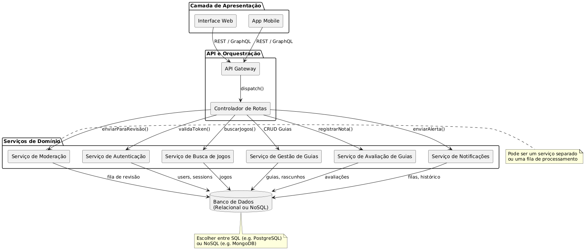

# Diagrama de Componentes 

## Introdução

O **Diagrama de Componentes** é uma representação visual que mostra a estrutura estática dos componentes do sistema e como eles se comunicam entre si. Ele evidencia responsabilidades, pontos de integração e protocolos de comunicação (REST, GraphQL, filas, etc.), sendo essencial para entender a arquitetura de alto nível e facilitar a evolução e manutenção do sistema.

Aqui, apresentamos o diagrama de componentes da plataforma de guias de jogos, que abrange desde a interface do usuário até a camada de persistência e serviços de domínio.

---

## Componentes Principais

### 1. Camada de Apresentação  
> Fornece a interface direta para os usuários finais.  
- **Interface Web**  
- **App Mobile**  

### 2. API e Orquestração  
> Recebe requisições externas, aplica cross-cutting concerns (autenticação, rate-limit, logging) e despacha para os serviços de domínio.  
- **API Gateway**  
- **Controlador de Rotas**  

### 3. Serviços de Domínio  
> Contêm a lógica de negócio principal e expõem funcionalidades específicas através de endpoints ou filas de mensagens.  
- **Serviço de Autenticação**  
- **Serviço de Busca de Jogos**  
- **Serviço de Gestão de Guias**  
- **Serviço de Avaliação de Guias**  
- **Serviço de Moderação**  
- **Serviço de Notificações**  

### 4. Banco de Dados  
> Camada de persistência, que pode ser relacional (PostgreSQL, MySQL) ou NoSQL (MongoDB).  
- **Banco de Dados (Relacional ou NoSQL)**  

---

## Interações Principais

| Fluxo / Chamada         | Origem                     | Destino                        |
|-------------------------|----------------------------|--------------------------------|
| REST / GraphQL          | Interface Web / App Mobile | API Gateway                    |
| `dispatch()`            | API Gateway                | Controlador de Rotas           |
| `validaToken()`         | Controlador de Rotas       | Serviço de Autenticação        |
| `buscarJogos()`         | Controlador de Rotas       | Serviço de Busca de Jogos      |
| CRUD de guias           | Controlador de Rotas       | Serviço de Gestão de Guias     |
| `registrarNota()`       | Controlador de Rotas       | Serviço de Avaliação de Guias  |
| `enviarParaRevisão()`   | Controlador de Rotas       | Serviço de Moderação           |
| `enviarAlerta()`        | Controlador de Rotas       | Serviço de Notificações        |
| Persistência de dados   | Serviços de Domínio        | Banco de Dados                 |

---

## Diagrama Visual

  
*Figura 1 – Visão geral dos componentes e suas integrações na plataforma Backseat*

---

## Histórico de Versão

| Versão | Alteração                               | Responsável                         | Revisor | Data       |
| ------ | ----------------------------------------| ----------------------------------- | ------- | ---------- |
| 1.0    | Criação do diagrama de componentes       | [Vitor Carvalho](https://github.com/vcpVitor) |         | 08/05/2025 |

