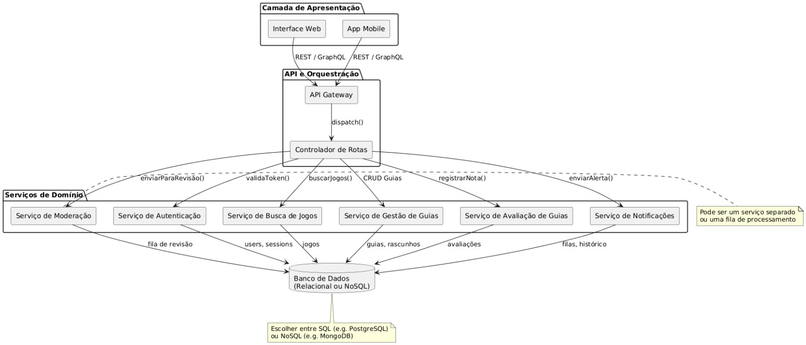
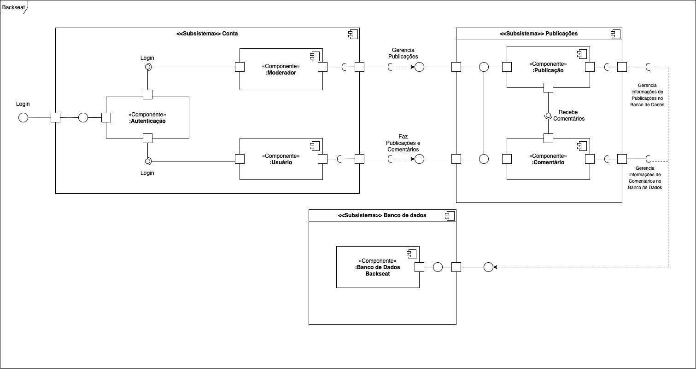

# Diagrama de Componentes - Plataforma de Guia de Jogos

## Introdução

O **Diagrama de Componentes** é uma representação visual que mostra a estrutura estática dos componentes do sistema e como eles se comunicam entre si. Ele evidencia responsabilidades, pontos de integração e protocolos de comunicação (REST, GraphQL, filas, etc.), sendo essencial para entender a arquitetura de alto nível e facilitar a evolução e manutenção do sistema.

Aqui, apresentamos o diagrama de componentes da plataforma de guias de jogos, que abrange desde a interface do usuário até a camada de persistência e serviços de domínio.

---

## Componentes Principais

### 1. Camada de Apresentação  
> Fornece a interface direta para os usuários finais.  
- **Interface Web**  
- **App Mobile**  

### 2. API e Orquestração  
> Recebe requisições externas, aplica cross-cutting concerns (autenticação, rate-limit, logging) e despacha para os serviços de domínio.  
- **API Gateway**  
- **Controlador de Rotas**  

### 3. Serviços de Domínio  
> Contêm a lógica de negócio principal e expõem funcionalidades específicas através de endpoints ou filas de mensagens.  
- **Serviço de Autenticação**  
- **Serviço de Busca de Jogos**  
- **Serviço de Gestão de Guias**  
- **Serviço de Avaliação de Guias**  
- **Serviço de Moderação**  
- **Serviço de Notificações**  

### 4. Banco de Dados  
> Camada de persistência, que pode ser relacional (PostgreSQL, MySQL) ou NoSQL (MongoDB).  
- **Banco de Dados (Relacional ou NoSQL)**  

---

## Interações Principais

| Fluxo / Chamada         | Origem                     | Destino                        |
|-------------------------|----------------------------|--------------------------------|
| REST / GraphQL          | Interface Web / App Mobile | API Gateway                    |
| `dispatch()`            | API Gateway                | Controlador de Rotas           |
| `validaToken()`         | Controlador de Rotas       | Serviço de Autenticação        |
| `buscarJogos()`         | Controlador de Rotas       | Serviço de Busca de Jogos      |
| CRUD de guias           | Controlador de Rotas       | Serviço de Gestão de Guias     |
| `registrarNota()`       | Controlador de Rotas       | Serviço de Avaliação de Guias  |
| `enviarParaRevisão()`   | Controlador de Rotas       | Serviço de Moderação           |
| `enviarAlerta()`        | Controlador de Rotas       | Serviço de Notificações        |
| Persistência de dados   | Serviços de Domínio        | Banco de Dados                 |

---

## Diagrama Visual

  
Figura 1 – Visão geral dos componentes e suas integrações na plataforma Backseat. Autor: Vitor

A equipe também desenvolveu outro diagrama de componentes, utilizando como base o documento de [definições do Backseat](https://docs.google.com/document/d/1FAuYqqCOM6dSgEaRmESRIExmBsOCEnG8qxCVmocoBr8/edit?usp=sharing), visando a completude por perspectivas diferentes. O segundo diagrama de componentes pode ser visto na figura dois, a seguir:

Figura 2 - Diagrama de Componentes da equipe. Autores: Rodrigo Orlandi, João Paulo

---

## Bibliografia:
SERRANO, Milene. Arquitetura e Desenho de Software. AULA - PROJETO E DESENHO DE SOFTWARE. Apresentação em Slide, 55 Slides, p 46-49. Disponível em: https://aprender3.unb.br/pluginfile.php/3070937/mod_page/content/1/Arquitetura%20e%20Desenho%20de%20Software%20-%20Aula%20Modelagem%20UML%20Est%C3%A1tica%20-%20Profa.%20Milene.pdf. Acesso em: 08/05/2025.

## Histórico de versão:

| Versão | Alteração                  | Responsável     | Revisor | Data       | Detalhes da Revisão |
| -      | -                          | -               | -       | -          | -                   |
| 1.0    | Elaboração do documento | [Rodrigo Orlandi](https://github.com/OrlandiRodrigo) e [João Paulo](https://github.com/joaombc)| | 08/05/2025 | |
| 1.1    | Adicionamos o Diagrama na página | [Rodrigo Orlandi](https://github.com/OrlandiRodrigo) e [João Paulo](https://github.com/joaombc)| | 08/05/2025 | |
| 1.2    | Criação do diagrama de componentes, reescrita do documento       | [Vitor Carvalho](https://github.com/vcpVitor) |  [Rodrigo Orlandi](https://github.com/OrlandiRodrigo)        | 08/05/2025 |  Documentos de diagramas de componentes combinados |
| 1.3    | Revisão do Diagrama de Componentes  | [Matheus Ferreira](https://github.com/matferreira1) e [Igor Thiago](https://github.com/Igor-Thiago) |  [Rodrigo Orlandi](https://github.com/OrlandiRodrigo)        | 08/05/2025 |  Revisão de imagens, textual - correção de imagem quebrada |
