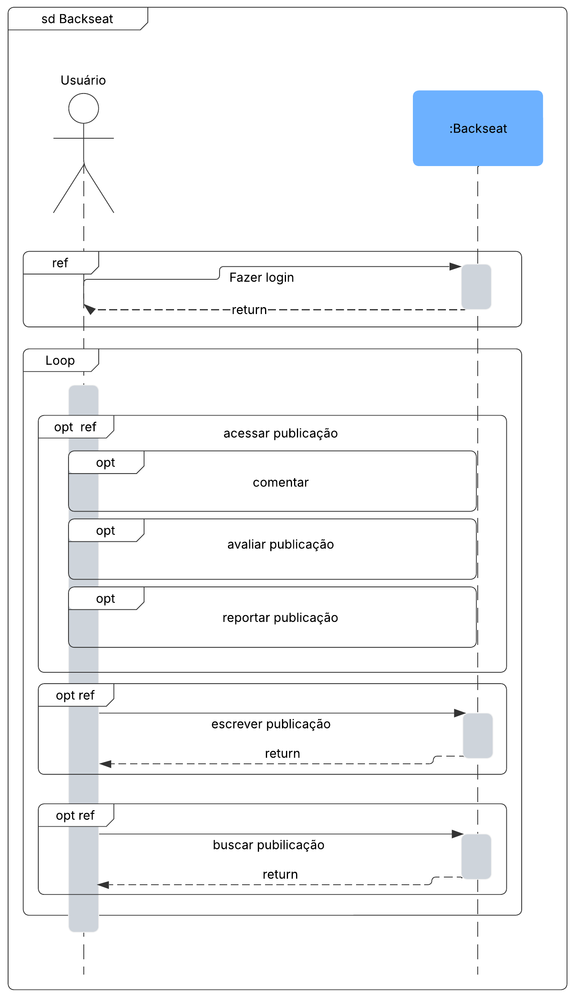
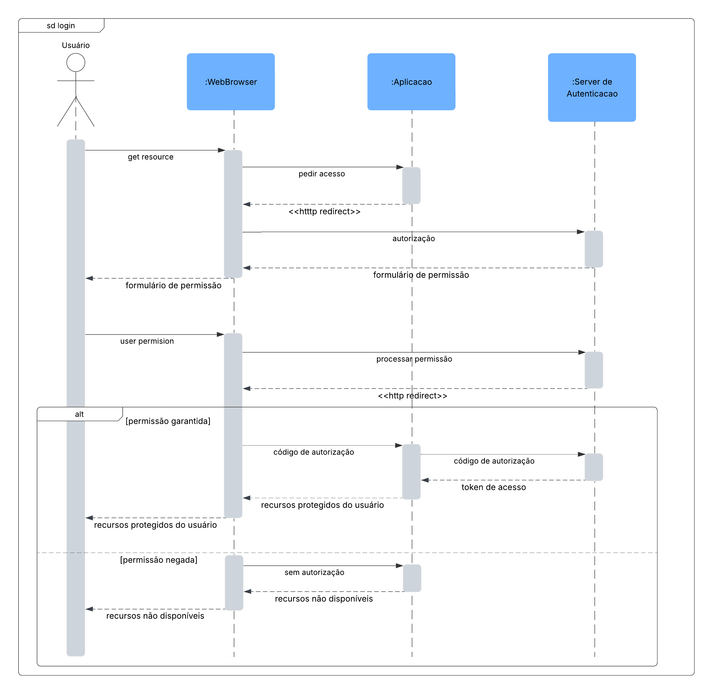
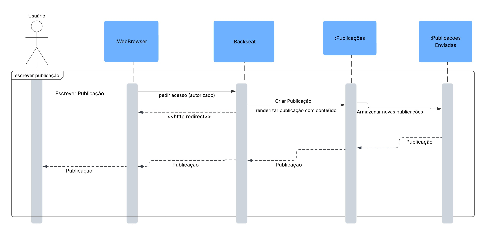

# Diagrama de Sequência - Plataforma de Guias de Jogos

## Introdução

O **Diagrama de Sequência** é destacado como o principal diagrama dinâmico da UML para a fase de projeto, pois modela interações entre objetos por meio de linhas de vida ([SERRANO](#referências), 2019).

## Metodologia

Para modelar os processos do sistema, primeiro foi analisada a estrutura do projeto. Foi utilizado o [documento de definição do sistema backseat](https://docs.google.com/document/d/1FAuYqqCOM6dSgEaRmESRIExmBsOCEnG8qxCVmocoBr8/edit?usp=sharing) para modelar identificando requisitos e fluxos. Em seguida, utilizamos o [Lucidchart](https://www.lucidchart.com/pages) para representar visualmente as atividades e decisões, garantindo clareza na sequência lógica. Essa abordagem permitiu uma transição eficiente da concepção para a implementação.

Primeiramente, foi definido um diagrama de sequência principal simplificado, que apresenta uma visão geral simples dos processos do sistema. A partir de sua definição, foram elaborados diagramas de **login**, **acessar publicação** e **escrever publicação**, disponibilizados a seguir.

### Diagrama Principal

O diagrama principal, disponível na figura 1, a seguir, representa o fluxo principal do projeto a partir das definições de sistema. Após realizar o login, o usuário entra em um loop com três opções de interação com o sistema, sendo essas *acessar*, *escrever* e *buscar* publicação. 

Figura 1 - Diagrama de Sequência principal. Autores: [Rodrigo Orlandi](https://github.com/) e [João Paulo](https://github.com/joaombc)

### Diagrama de Login

O diagrama de login demonstra as entidades do projeto relativas ao acesso e à autenticação: o Servidor Web em que o aplicativo estaria hosteado, o aplicativo web Backseat, descrito como :*Aplicacao*, e o servidor de autenticação do aplicativo, que também comunica com o banco de dados de usuários cadastrados.

O diagrama de login foi desenvolvido referenciando o diagrama de login presente no [conteúdo didático de slides da matéria](#referências), presente na página 11, que descreve o servidor de autenticação do Facebook.

Figura 2 - Diagrama de Sequência de login. Autor: [João Paulo](https://github.com/joaombc)

### Diagrama de Acessar Publicação

Abaixo está o diagrama de sequência “Acessar Publicação”, que ilustra o passo a passo completo da interação do usuário com a plataforma Backseat, desde a solicitação de acesso ao conteúdo até o registro de suas ações. Além do fluxo principal de autenticação e carregamento da publicação, o diagrama detalha três cenários alternativos: comentar, avaliar e reportar. Mostrando as mensagens trocadas entre o navegador, o serviço Backseat, os módulos de Publicações e Publicações Enviadas e o Banco de Dados de Comentários.

Figura 3 - Diagrama de Sequência de Acessar Publicação. Autores [Igor Thiago](https://github.com/Igor-Thiago) e [Rodrigo Orlandi](https://github.com/)

### Diagrama de Escrever Publicação

Por fim, para esta entrega, foi desenvolvido também o diagrama de sequência com base em escrever publicações. A divisão do banco de dados de Publicação entre publicações enviadas e não enviadas reflete a funcionalidade de *autosave* que o sistema inclui, sendo esta referente à salvar rascunhos de publicações de usuários, justificando a necessidade de um banco para publicações incompletas.

Figura 4 - Diagrama de Sequência de Acessar Publicação. Autor: [João Marques](https://github.com/jmarquees)

## Referências
SERRANO, Milene. Arquitetura e Desenho de Software. AULA - MODELAGEM UML DINÂMICA. Apresentação em Slide, 28 Slides, p 5-11. Disponível em: https://aprender3.unb.br/pluginfile.php/3070938/mod_page/content/1/Arquitetura%20e%20Desenho%20de%20Software%20-%20Aula%20Modelagem%20UML%20Din%C3%A2mica%20-%20Profa.%20Milene.pdf. Acesso em: 08/05/2025.

## Histórico de versão:

| Versão | Alteração                  | Responsável     | Revisor | Data       | Detalhes da Revisão |
| -      | -                          | -               | -       | -          | -                   |
| 1.0    | Elaboração do documento | [João Paulo](https://github.com/joaombc) e [Rodrigo Orlandi](https://github.com/)| | 05/05/2025 | |
| 1.1    | Adicionado Diagrama de Acessar Publicação | [Igor Thiago](https://github.com/Igor-Thiago) e [Rodrigo Orlandi](https://github.com/)| | 08/05/2025 | |
| 1.2    | Adicionado Diagrama Geral e de Login, descrições, referências | [Rodrigo Orlandi](https://github.com/) e [João Paulo](https://github.com/joaombc) | | 08/05/2025 | |
| 1.3    | Revisão   | [Matheus Ferreira](https://github.com/matferreira1) |     |  08/05/2025 |  Correção de imagem quebrada, verificação e revisão do texto       |    
