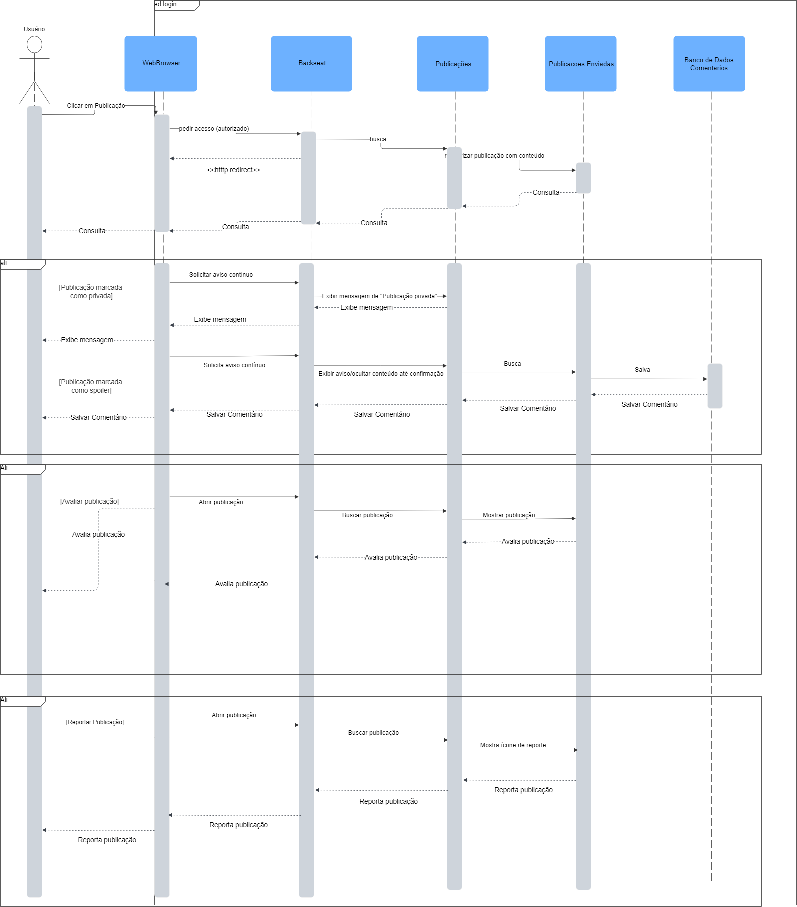

# Diagrama de Sequência - Plataforma de Guias de Jogos

## Introdução

O **Diagrama de Sequência** é destacado como o principal diagrama dinâmico da UML para a fase de projeto, pois modela interações entre objetos por meio de linhas de vida ([SERRANO](#referências), 2019).

## Metodologia
Para modelar os processos do sistema, primeiro analisamos a estrutura do projeto, identificando requisitos e fluxos. Em seguida, utilizamos o [Lucidchart](https://www.lucidchart.com/pages) para representar visualmente as atividades e decisões, garantindo clareza na sequência lógica. Essa abordagem permitiu uma transição eficiente da concepção para a implementação.

## Diagramas

Abaixo está o diagrama de sequência “Acessar Publicação”, que ilustra o passo a passo completo da interação do usuário com a plataforma Backseat, desde a solicitação de acesso ao conteúdo até o registro de suas ações. Além do fluxo principal de autenticação e carregamento da publicação, o diagrama detalha três cenários alternativos: comentar, avaliar e reportar. Mostrando as mensagens trocadas entre o navegador, o serviço Backseat, os módulos de Publicações e Publicações Enviadas e o Banco de Dados de Comentários.

Figura 1 - Diagrama de Sequência de Acessar Publicação. Autor [Igor Thiago](https://github.com/Igor-Thiago)

## Referências

## Histórico de versão:

| Versão | Alteração                  | Responsável     | Revisor | Data       | Detalhes da Revisão |
| -      | -                          | -               | -       | -          | -                   |
| 1.0    | Elaboração do documento | [João Paulo](https://github.com/joaombc) e [Rodrigo Orlandi](https://github.com/)| | 05/05/2025 | |
