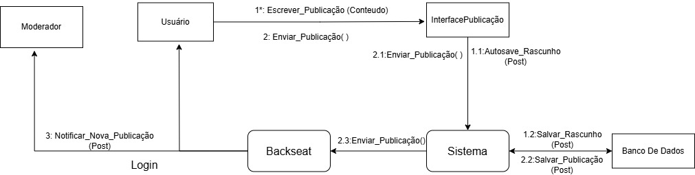

# Diagrama de Colaboração - Plataforma de Guias de Jogos

## Introdução

O **Diagrama de Colaboração** é uma representação que ilustra como os objetos interagem em um processo, destacando a sequência de mensagens trocadas entre eles para atingir um objetivo específico. Este tipo de diagrama ajuda a entender o fluxo de interação entre os componentes do sistema.

Abaixo, apresentamos o diagrama de colaboração para o processo de criação e envio de uma publicação na plataforma de guias de jogos, que envolve a interação entre o usuário, a interface de publicação, o sistema, o banco de dados e o moderador.

## Objetos e Mensagens

### Objetos Envolvidos

- **:Usuario**: O usuário da plataforma, que interage com a interface para criar e enviar publicações.
- **:InterfacePublicacao**: A interface que gerencia a criação e envio de publicações.
- **:Sistema**: O sistema que gerencia as operações relacionadas às publicações.
- **:BancoDeDados**: O banco de dados que armazena informações sobre as publicações.
- **:Moderador**: O moderador que recebe notificações sobre novas publicações.

### Mensagens Trocas (Ordem de Execução)

1. **:Usuario → :InterfacePublicacao**  
   *Mensagem:* `escrever_publicacao(conteúdo)`  
   O usuário começa a escrever uma nova publicação.

2. **:InterfacePublicacao → :Sistema**  
   *Mensagem:* `autosave_rascunho(Post)`  
   A interface salva automaticamente o rascunho da publicação no sistema.

3. **:Sistema → :BancoDeDados**  
   *Mensagem:* `salvar_rascunho(Post)`  
   O sistema armazena o rascunho da publicação no banco de dados.

4. **:Usuario → :InterfacePublicacao**  
   *Mensagem:* `enviar_publicacao()`  
   O usuário decide enviar a publicação finalizada.

5. **:InterfacePublicacao → :Sistema**  
   *Mensagem:* `enviar_publicacao(Post)`  
   A interface envia a publicação para o sistema.

6. **:Sistema → :BancoDeDados**  
   *Mensagem:* `salvar_publicacao(Post)`  
   O sistema armazena a publicação finalizada no banco de dados.

7. **:Sistema → :Moderador**  
   *Mensagem:* `notificar_nova_publicacao(Post)`  
   O sistema notifica o moderador sobre a nova publicação.

## Diagrama Visual

A representação visual das interações entre os objetos pode ser vista a seguir:

Figura 1 - Diagrama de Colaboração para Criação e Envio de Publicação (Fonte: Júlio Cesar e Fernando Gabriel)

## Referências

## Histórico de versão:

| Versão | Alteração                  | Responsável     | Revisor | Data       | Detalhes da Revisão |
| -      | -                          | -               | -       | -          | -                   |
| 1.0    | Elaboração do documento | [Júlio Cesar](https://github.com/Julio1099) e [Fernando Gabriel](https://github.com/show-dawn)| | 01/05/2025 | |

