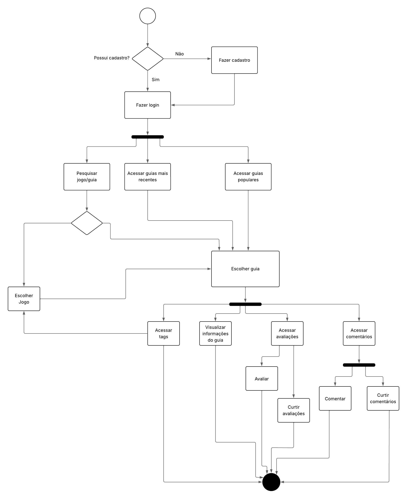
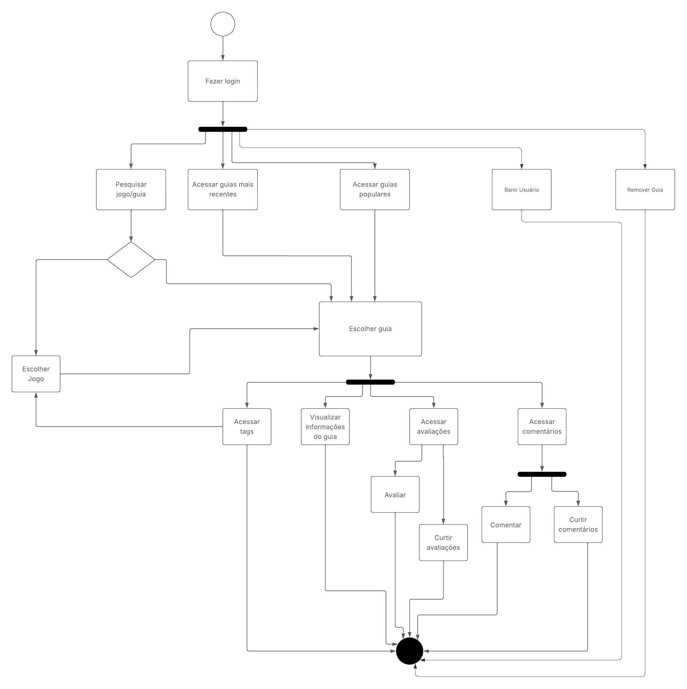

# Diagrama de Atividades

## Introdução

O diagrama de atividades é um diagrama de comportamento da UML que mostra o fluxo de controle ou o fluxo de objetos, com ênfase na sequência e nas condições desse fluxo. As ações coordenadas pelos modelos de atividades podem ser iniciadas quando outras ações terminam sua execução, quando objetos e dados se tornam disponíveis ou quando ocorrem eventos externos ao fluxo.

## Metodologia

Para criar os diagramas de atividades, analisamos o projeto para identificar as atividades de cada entidade. Essas definições podem ser vistas neste documento: [ACESSO](https://docs.google.com/document/d/1FAuYqqCOM6dSgEaRmESRIExmBsOCEnG8qxCVmocoBr8/). Em seguida, utilizamos o [Lucidchart](https://www.lucidchart.com/pages) para criar os diagramas para as duas entidades identificadas, o usuário e o moderador.

## Diagrama de Atividades do Usuário

Figura 1 - Diagrama de Atividades do Usuário (Autores: Rodrigo Gontijo e Henrique Galdino)

## Diagrama de Atividades do Moderador

Figura 2 - Diagrama de Atividades do Moderador (Autores: Rodrigo Gontijo e Henrique Galdino)

## Bibliografia 

> LUCID SOFTWARE. UML Activity Diagram Tutorial. Lucidchart. Disponível em: https://www.lucidchart.com/pages/uml-activity-diagram. Acesso em: 8 maio 2025.
> 
> UML DIAGRAMS. Activity diagrams. . Disponível em: https://www.uml-diagrams.org/activity-diagrams.html. Acesso em: 8 maio 2025.

## Histórico de versão:

| Versão | Alteração                  | Responsável     | Revisor | Data       | Detalhes da Revisão |
| -      | -                          | -               | -       | -          | -                   |
| 1.0    | Elaboração do texto | [Rodrigo Gontijo](https://github.com/rodrigogontijoo) | | 08/05/2025 | |
| 1.1    | Elaboração dos diagramas | [Henrique Galdino](https://github.com/hgaldino05) e [Rodrigo Gontijo](https://github.com/rodrigogontijoo) | | 08/05/2025 | |

