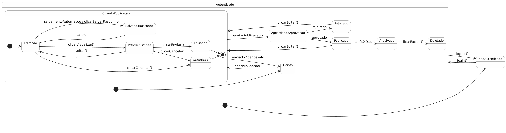

# Diagrama de Estados

## Introdução

O **Diagrama de Estados** é uma representação visual usada para descrever os possíveis estados de uma entidade ao longo do seu ciclo de vida e as transições entre esses estados, disparadas por eventos internos, ações do usuário ou condições do sistema. Esse tipo de diagrama é especialmente útil para mapear o comportamento dinâmico de componentes, garantindo que todos os fluxos – normais e de exceção – estejam claramente definidos.

Neste caso, apresentamos o diagrama de estados da publicação na plataforma de guias de jogos. Ele cobre desde o ponto em que o usuário ainda não está Não Autenticado, passando pelo estado Ocioso assim que faz login, até todo o sub-fluxo de CriandoPublicacao (com os sub-estados Editando, SalvandoRascunho, Previsualizando, Enviando e Cancelado), seguido pelos estados de moderação (AguardandoAprovacao, Rejeitado ou Publicado) e, finalmente, pelas etapas de limpeza de conteúdo (Arquivado e Deletado). Cada transição (“clicarEnviar()”, “rejeitado”, “aprovado”, “após X dias” etc.) reflete uma ação do usuário ou um evento do sistema, tornando visível todo o fluxo de vida de uma publicação, desde o rascunho até sua exclusão definitiva.

## Estados Principais

### 1. `NaoAutenticado`  
> Estado inicial em que o visitante não possui sessão ativa.  
- **login()** → `Ocioso`  
- **logout()** ← qualquer retorno de sessão  

---

### 2. `Ocioso`  
> Usuário autenticado, sem publicação em edição.  
- **criarPublicacao()** → `Editando`  

---

### 3. `CriandoPublicacao`  
> Workflow de elaboração de um guia, composto por vários sub-estados:  

#### 3.1 `Editando`  
> Escrita ativa do rascunho.  
- **salvamentoAutomatico** /\ **clicarSalvarRascunho()** → `SalvandoRascunho`  
- **clicarVisualizar()** → `Previsualizando`  
- **clicarEnviar()** → `Enviando`  
- **clicarCancelar()** → `Cancelado`  

#### 3.2 `SalvandoRascunho`  
> Persistindo alterações temporárias.  
- Ao concluir (evento **salvo**) retorna → `Editando`  

#### 3.3 `Previsualizando`  
> Revisão do rascunho antes do envio.  
- **voltar()** → `Editando`  
- **clicarEnviar()** → `Enviando`  
- **clicarCancelar()** → `Cancelado`  

#### 3.4 `Enviando`  
> Submetendo rascunho para moderação.  
- Ao finalizar (evento **enviado**) → `AguardandoAprovacao`  
- **clicarCancelar()** → `Cancelado`  

#### 3.5 `Cancelado`  
> Operação abortada, rascunho descartado.  
- Evento **cancelado** retorna → `Ocioso`  

---

### 4. `AguardandoAprovacao`  
> Publicação pendente de moderação.  
- **aprovado** → `Publicado`  
- **rejeitado** → `Rejeitado`  

---

### 5. `Rejeitado`  
> Rascunho recusado pela moderação.  
- **clicarEditar()** → `Editando`  

---

### 6. `Publicado`  
> Conteúdo disponível publicamente.  
- Evento **após X dias** → `Arquivado`  
- **clicarEditar()** → `Editando`  

---

### 7. `Arquivado`  
> Conteúdo retirado da lista ativa, mas ainda recuperável.  
- **clicarExcluir()** → `Deletado`  

---

### 8. `Deletado`  
> Estado final. Conteúdo removido permanentemente; sem transições de saída.  

---

## Transições Principais

| Evento / Ação            | De                         | Para                              |
|--------------------------:|:---------------------------|:----------------------------------|
| `login()`                 | —                          | `Ocioso`                          |
| `criarPublicacao()`       | `Ocioso`                   | `Editando`                        |
| `clicarSalvarRascunho()`  | `Editando`                 | `SalvandoRascunho`                |
| `salvo`                   | `SalvandoRascunho`         | `Editando`                        |
| `clicarVisualizar()`      | `Editando`                 | `Previsualizando`                 |
| `voltar()`                | `Previsualizando`          | `Editando`                        |
| `clicarEnviar()`          | `Editando` / `Previsualizando` | `Enviando`                |
| `enviado`                 | `Enviando`                 | `AguardandoAprovacao`             |
| `aprovado`                | `AguardandoAprovacao`      | `Publicado`                       |
| `rejeitado`               | `AguardandoAprovacao`      | `Rejeitado`                       |
| `clicarEditar()`          | `Rejeitado` / `Publicado`  | `Editando`                        |
| `após X dias`             | `Publicado`                | `Arquivado`                       |
| `clicarExcluir()`         | `Arquivado`                | `Deletado`                        |
| `clicarCancelar()`        | em qualquer sub-estado     | `Cancelado` → `Ocioso`            |
| `logout()`                | qualquer estado            | `NaoAutenticado`                  |

## Diagrama Visual

  
*Figura 1 – Ciclo de vida de uma publicação na plataforma de guias de jogos*

---

## Histórico de Versão

| Versão | Alteração                                    | Responsável                                                                   | Revisor | Data       |
| ------ | --------------------------------------------- | ----------------------------------------------------------------------------- | ------- | ---------- |
| 1.0    | Criação do diagrama de estados                | [Vitor Carvalho](https://github.com/vcpVitor) |         | 10/05/2025 |