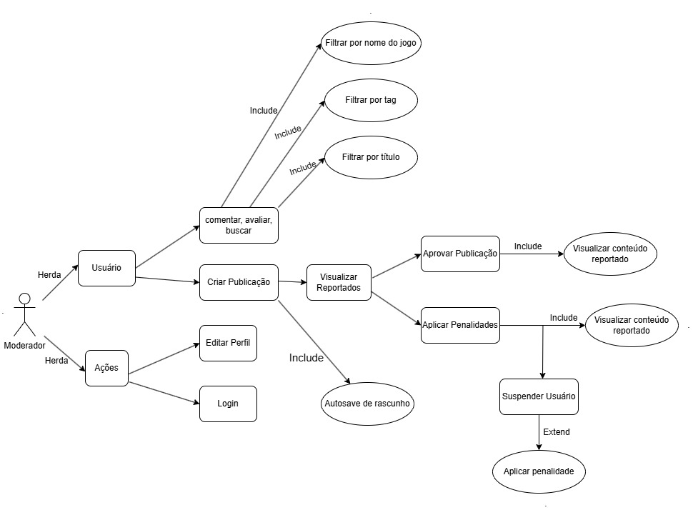

# Diagrama de Casos de Uso - Plataforma de Guias de Jogos

# **Introdução**

Casos de uso são instrumentos fundamentais na modelagem de sistemas, pois representam visualmente os requisitos funcionais e as interações entre os usuários e o sistema. Eles descrevem, de forma estruturada, os objetivos que os atores desejam alcançar ao utilizar o sistema e as sequências de ações necessárias para isso. Essa abordagem facilita a comunicação entre desenvolvedores, analistas e stakeholders, promovendo um entendimento claro das funcionalidades esperadas.

Neste projeto, o foco recai sobre as ações atribuídas ao **moderador** (ou **administrador**) em uma plataforma voltada para publicações e comentários sobre jogos. O moderador desempenha um papel crítico na moderação do conteúdo gerado pelos usuários, assegurando que as interações estejam alinhadas às diretrizes da comunidade. Suas funções incluem a análise de publicações reportadas, aprovação de novos conteúdos e aplicação de penalidades quando necessário.

---

## **Metodologia**

Para a construção do diagrama de casos de uso, primeiramente foram identificados os principais atores do sistema, a saber: o **usuário comum** e o **moderador**. Consideraram-se os perfis de usuário e as personas previamente definidas, a fim de mapear os casos de uso relevantes que deveriam compor o escopo da plataforma **BackSeat**.

Na sequência, foram levantadas e organizadas as principais ações que cada tipo de usuário pode realizar na aplicação, como: cadastro, autenticação, criação de publicações, interação por meio de comentários, e funcionalidades específicas para o moderador, como visualização de conteúdos reportados e aplicação de sanções. O objetivo foi elaborar um diagrama claro, objetivo e funcional, capaz de orientar o desenvolvimento do sistema de maneira eficiente, coerente e centrada no usuário.

---

## **Diagramas de Casos de Uso**

### Diagrama Geral: Usuário e Administrador  
**Figura 1** – Diagrama de casos de uso combinando ações do usuário e do administrador.  
*Fonte: elaboração própria.*

---

### Diagrama Específico: Usuário  
**Figura 2** – Diagrama de casos de uso específico para o usuário.  
*Fonte: elaboração própria.*

---

### Diagrama Específico: Administrador  
**Figura 3** – Diagrama de casos de uso específico para o administrador/moderador.  

  
*Fonte: [Júlio Cesar](https://github.com/Julio1099) e [Fernando Gabriel](https://github.com/show-dawn)*

---

## **Referências Bibliográficas**
---

## **Histórico de Versão**

| Versão | Alteração                 | Responsável                                                                 | Revisor | Data       | Detalhes da Revisão     |
|--------|---------------------------|------------------------------------------------------------------------------|---------|------------|--------------------------|
| 1.0    | Elaboração do documento   | [Júlio Cesar](https://github.com/Julio1099), [Fernando Gabriel](https://github.com/show-dawn) | —       | 08/05/2025 | Documento inicial criado |
