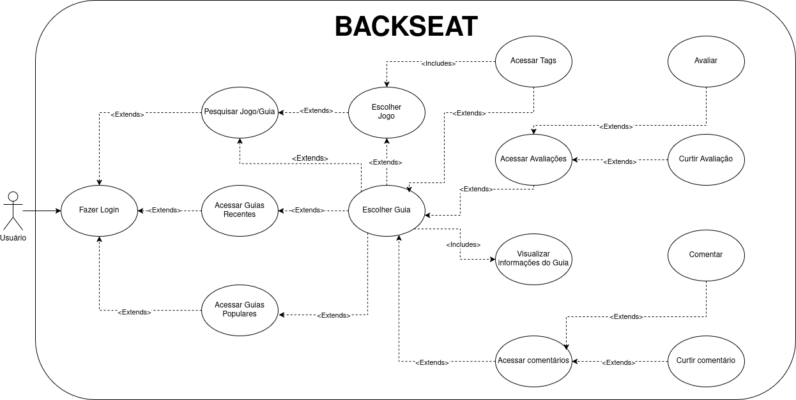

# Diagrama de Casos de Uso - Plataforma de Guias de Jogos

# **Introdução**

Casos de uso são instrumentos fundamentais na modelagem de sistemas, pois representam visualmente os requisitos funcionais e as interações entre os usuários e o sistema. Eles descrevem, de forma estruturada, os objetivos que os atores desejam alcançar ao utilizar o sistema e as sequências de ações necessárias para isso. Essa abordagem facilita a comunicação entre desenvolvedores, analistas e stakeholders, promovendo um entendimento claro das funcionalidades esperadas.

Neste projeto, o foco recai sobre as ações atribuídas ao **moderador** (ou **administrador**) em uma plataforma voltada para publicações e comentários sobre jogos. O moderador desempenha um papel crítico na moderação do conteúdo gerado pelos usuários, assegurando que as interações estejam alinhadas às diretrizes da comunidade. Suas funções incluem a análise de publicações reportadas, aprovação de novos conteúdos e aplicação de penalidades quando necessário.

---

## **Metodologia**

Para a construção do diagrama de casos de uso, primeiramente foram identificados os principais atores do sistema, a saber: o **usuário comum** e o **moderador**. Consideraram-se os perfis de usuário e as personas previamente definidas, a fim de mapear os casos de uso relevantes que deveriam compor o escopo da plataforma **BackSeat**.

Na sequência, foram levantadas e organizadas as principais ações que cada tipo de usuário pode realizar na aplicação, como: cadastro, autenticação, criação de publicações, interação por meio de comentários, e funcionalidades específicas para o moderador, como visualização de conteúdos reportados e aplicação de sanções. O objetivo foi elaborar um diagrama claro, objetivo e funcional, capaz de orientar o desenvolvimento do sistema de maneira eficiente, coerente e centrada no usuário.

---

## **Diagramas de Casos de Uso**

### Diagrama Geral: Usuário e Moderador 

 

**Figura 1** – Diagrama de casos de uso combinando ações do usuário e do administrador.  
Autores: [Rodrigo Orlandi](https://github.com/orlandirodrigo), [João Paulo](https://github.com/joaombc), [João Marques](https://github.com/jmarquees) 

---

### Diagrama Específico: Usuário  

  

**Figura 2** – Diagrama de casos de uso específico para o usuário.  
Autores: [Henrique Galdino](https://github.com/hgaldino05), [Igor Thiago](https://github.com/Igor-Thiago) e [Rodrigo Gontijo](https://github.com/rodrigogontijoo)

---

### Diagrama Específico: Moderador

  

**Figura 3** – Diagrama de casos de uso específico para o administrador/moderador.  
*Fonte: [Júlio Cesar](https://github.com/Julio1099), [Fernando Gabriel](https://github.com/show-dawn) e [Matheus Ferreira](https://github.com/matferreira1)

### Comentário sobre a Base de Referência

Este trabalho foi desenvolvido tendo como base a modelagem apresentada pelo Grupo 2 no repositório “Brechó – Entrega 02” disponível em https://unbarqdsw2024-2.github.io/2024.2_G2_Brecho_Entrega_02_/#/Modelagem/DiagramaCasoUso. As definições de atores, casos de uso e a estruturação das interações foram adaptadas e refinadas a partir daquele estudo, garantindo consistência metodológica e alinhamento conceitual.

---

## **Referências Bibliográficas**

- Brechó – Grupo 2. Diagrama de Casos de Uso. Disponível em: https://unbarqdsw2024-2.github.io/2024.2_G2_Brecho_Entrega_02_/#/Modelagem/DiagramaCasoUso. Acesso em: 08 de maio de 2025.  
- Júlio Cesar e Fernando Gabriel. Elaboração própria dos diagramas. 08 de maio de 2025.

---

## **Histórico de Versão**

| Versão | Alteração                 | Responsável                                                                 | Revisor | Data       | Detalhes da Revisão     |
|--------|---------------------------|------------------------------------------------------------------------------|---------|------------|--------------------------|
| 1.0    | Elaboração do documento   | [Júlio Cesar](https://github.com/Julio1099), [Fernando Gabriel](https://github.com/show-dawn) | [Matheus Ferreira](https://github.com/matferreira1) | 08/05/2025 | Documento inicial criado |
| 1.1    | Revisão do diagrama de admin   | [Matheus Ferreira](https://github.com/matferreira1) | —       | 08/05/2025 | Correções no documento |
| 1.2    | Adição do diagrama de casos de uso do usuário.    | [Henrique Galdino](https://github.com/hgaldino05), [Igor Thiago](https://github.com/Igor-Thiago), [Rodrigo Gontijo](https://github.com/rodrigogontijoo) |  | 08/05/2025 | |
| 1.3    | Inclusão de referência e comentário sobre base | [Vitor Carvalho](https://github.com/vcpVitor) | — | 08/05/2025 | Adicionada referência bibliográfica e parágrafo de fundamentação |
| 1.4    | Adição do último diagrama | [Rodrigo Orlandi](https://github.com/orlandirodrigo), [João Paulo](https://github.com/joaombc), [João Marques](https://github.com/jmarquees) | — | 08/05/2025 |  |
| 1.5    | Correção do diagrama de casos de uso do usuário.    | [Henrique Galdino](https://github.com/hgaldino05), [Rodrigo Gontijo](https://github.com/rodrigogontijoo) |  | 09/05/2025 | |
