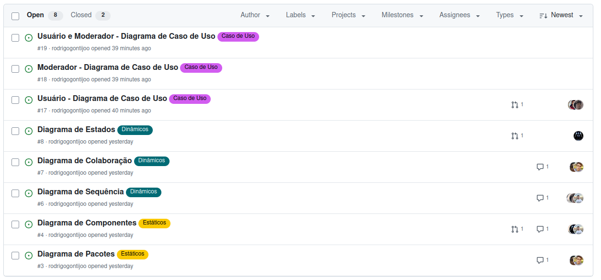

# 2.5. Iniciativas Extras (Modelagem)

## Documentação de Issues

Com objetivo de manter claro quais tarefas ja foram realizadas, e quais precisam ser realizadas, foram criadas issues para cada atividade da entrega 2.

Acesso às issues: [Issues](https://github.com/UnBArqDsw2025-1-Turma02/2025.1-T02_G5_BackSeat_Entrega_02/issues)

Figura 1 - Issues no github (Autor: Rodrigo Gontijo)

## Histórico de versão:

| Versão | Alteração                  | Responsável     | Revisor | Data       | Detalhes da Revisão |
| -      | -                          | -               | -       | -          | -                   |
| 1.0    | Elaboração do documento | [Rodrigo Gontijo](https://github.com/rodrigogontijoo)| | 08/05/2025 | |
