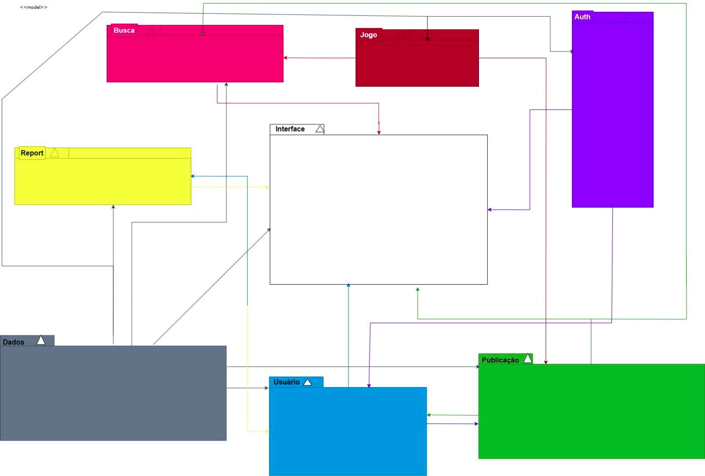
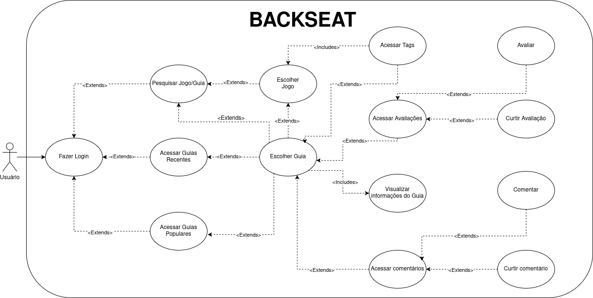

# Backseat

**Código da Disciplina**: FGA0208 
**Número do Grupo**: 05 
**Entrega**: 02 

## Alunos
| Matrícula   | Aluno                                           |
|-------------|-------------------------------------------------|
| 22/1008033  | Fernando Gabriel Dos Santos Carrijo             |
| 20/0058258  | Henrique Galdino Couto                          |
| 19/0029692  | Igor Thiago Lima de Santana                     |
| 20/2045141  | João Paulo Monteiro de Barros Ceva Rodrigues    |
| 20/0058576  | Joao Victor Marques Reis de Miranda             |
| 22/1007591  | Julio Cesar Gomes de Souza Crispim              |
| 20/0024949  | Matheus Ferreira Diogo                          |
| 19/0116498  | Rodrigo Braz Ferreira Gontijo                   |
| 20/2017129  | Rodrigo de Andrade Lima Orlandi                 |
| 21/1062615  | Vitor Carvalho Pereira                          |

## Sobre 

O projeto Backseat busca uma maneira divertida de apresentar o conhecimento adquirido e compartilhá-lo com interessados em jogos. Alguns podem ser crípticos e outros nem tanto, mas acreditamos que a experiência do jogador é válida, e pode ajudar jogadores novos e interessados em desbloquear novos níveis da jornada.

Sua função principal será o compartilhamento e visualização de guias relacionados a tópicos e fases de jogos, com o intuito de deixar o conhecimento o mais acessível possível. Serão fornecidas aos usuários opções de busca de jogos, guias e dar notas a guias. 
	
Esperamos fornecer novas conexões e experiências únicas a quem deseja participar.

## Screenshots da Segunda Entrega

	
Figura 1 - Diagrama de Pacotes da Plataforma de Guias de Jogos (Fonte: Júlio Cesar e Fernando Gabriel)

  

	
Figura 2 – Diagrama de casos de uso específico para o usuário (Autores: Henrique Galdino, Igor Thiago e Rodrigo Gontijo)

## Há algo a ser executado?

( ) SIM

(X) NÃO

Se SIM, insira um manual (ou um script) para auxiliar ainda mais os interessados na execução.

## Histórico de versão:

| Versão | Alteração                  | Responsável     | Revisor | Data       | Detalhes da Revisão |
| -      | -                          | -               | -       | -          | -                   |
| 1.0    | Elaboração do documento | [Rodrigo Gontijo](https://github.com/rodrigogontijoo)| | 30/04/2025 | |
| 1.1    | Adição das screenshots de artefatos | [Rodrigo Gontijo](https://github.com/rodrigogontijoo)| | 08/05/2025 | |
| 1.2    | Atualizando diagramas das screenshots | [Rodrigo Gontijo](https://github.com/rodrigogontijoo)| | 09/05/2025 | |

